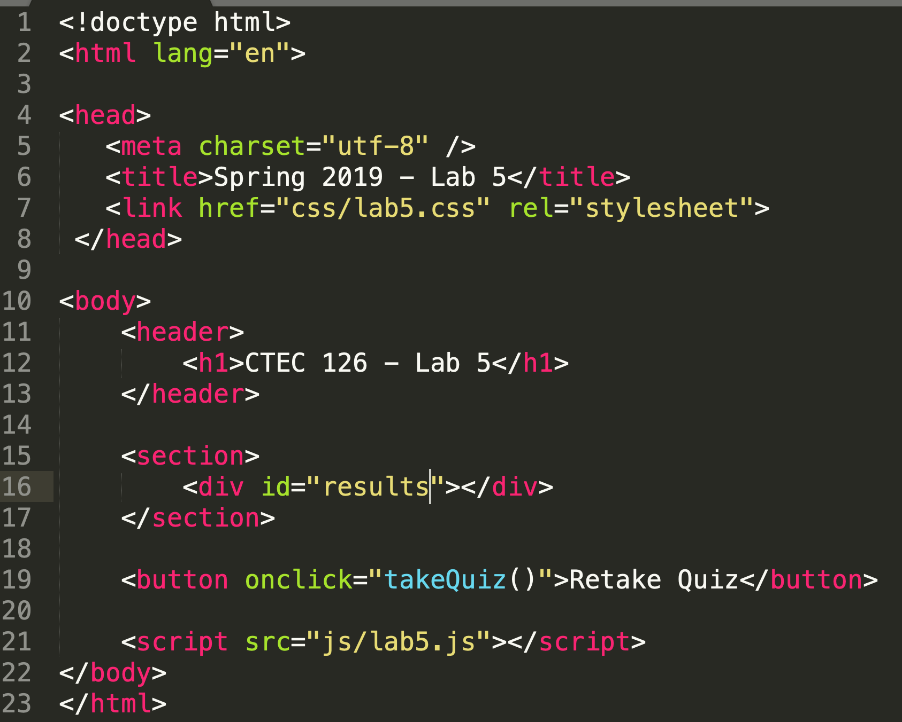

# CTEC 126 - Lab No. 5

## Make a Simple Quiz

Using HTML, CSS and an external JavaScript file, build a web page that presents a quiz to a visitor using the following requirements (Be sure to first read through all of the requirements prior to writing a single line of code). You can use prompts and alerts for this lab. I have provided some stub code in the lab5.js file for you.

1. Use the file lab5.html for your HTML
2. Use the CSS file lab5.css in the a folder named css
3. Use the JavaScript file lab5.js in the js folder.
4. Create an array named **questions**. This array will hold 10 arrays. Each of the 10 arrays will contain a single question and the answer to that question.
5. Creat a function named takeQuiz(). This function will be called to start your JavaScript code
6. In the takeQuiz function ask the user for their name and store it in a variable
7. Users are to be asked each of the 10 questions in order. After each question is asked you are to compare their answer with the answer stored in the array. If they answer the question correctly let them know. You also need to keep track of the number of questions that the users answer correctly and incorrectly.  
8. Create a function that handles Step 7. Your JavaScript should call this function to display the current question from the array. Your function should accept a single parameter. Hint: This parameter is actually an array containing the question and the answer.
9. Create a second function. This function should be called to present the information contained in steps 10 and 11 below.
10. Once all of the questions and answers have been asked and answered display a summary of the quiz to the user in a section. Use the techniques you learned during Weeks 1 and 2 of this course. See the [screenshot](screenshot.png) for more info. Include their name, the number of questions answered correctly and incorrectly. You can use a template string to build all of the output before adding it to the div in the section.
11. Use logic to display a message to the user based on the following: If they answered all 10 questions correctly display a congratulatory message.  If they scored 9/10 let them know they did a good job. If the score was anything less than 9/10 present them with a snarky message letting them know that they can retake this quiz by clicking the "Take a Quiz" button (the button is described in Step 12).
12. Add a button to the page that when clicked executes the code needed to take the quiz. Hint: This will call a function that you create that contains the mainline logic for the script.
13. All of your code must be sufficiently commented. Comments must be meaningful and not simply be stating the syntax of the code.
14. Push your work back to GitHub

Here is how my HTML is setup:

## Grading Rubric

| Item | Full Marks  | Partial Marks | No Marks |
|:--|:--|:--|:--|
| Questions are presented to user | 50 | 20 | 0 |
| The program lets the user know if they got the answer wrong or right | 20 | 10 | 0 |
| The program displays required summary on the web page | 20 | 10 | 0 |
| HTNL/CSS Validate | 10 | 5 | 0 |